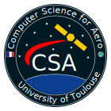

# 2021_m1csa_misc_logo
Shield: [![CC BY-NC-SA 4.0][cc-by-nc-sa-shield]][cc-by-nc-sa]

This work is licensed under a
[Creative Commons Attribution-NonCommercial-ShareAlike 4.0 International License][cc-by-nc-sa].

[![CC BY-NC-SA 4.0][cc-by-nc-sa-image]][cc-by-nc-sa]

[cc-by-nc-sa]: http://creativecommons.org/licenses/by-nc-sa/4.0/
[cc-by-nc-sa-image]: https://licensebuttons.net/l/by-nc-sa/4.0/88x31.png
[cc-by-nc-sa-shield]: https://img.shields.io/badge/License-CC%20BY--NC--SA%204.0-lightgrey.svg

## Goal
Design of the logo of the master CSA

## Tree structure
* archive/ => all past versions with their quirks
* rc/ => release candidates (have to be submitted to a vote)
* res/ => resources used for this project (prefer .svg open source files)

The root of this project contains the current versions of the logo being worked on.
The .gitignore will ignore all .png productions excepted those in the rc/ file.

## Tools used
* Inkscape => This tool is mandatory if you want to contribute to the current logo
              (excepted if you're redesigning it from scratch).

## Thanks
I thank all of my colleagues from the master CSA for their constructive criticsm and ideas.

